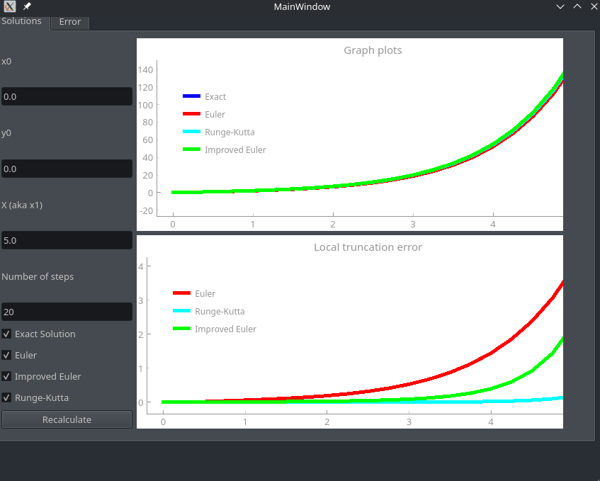
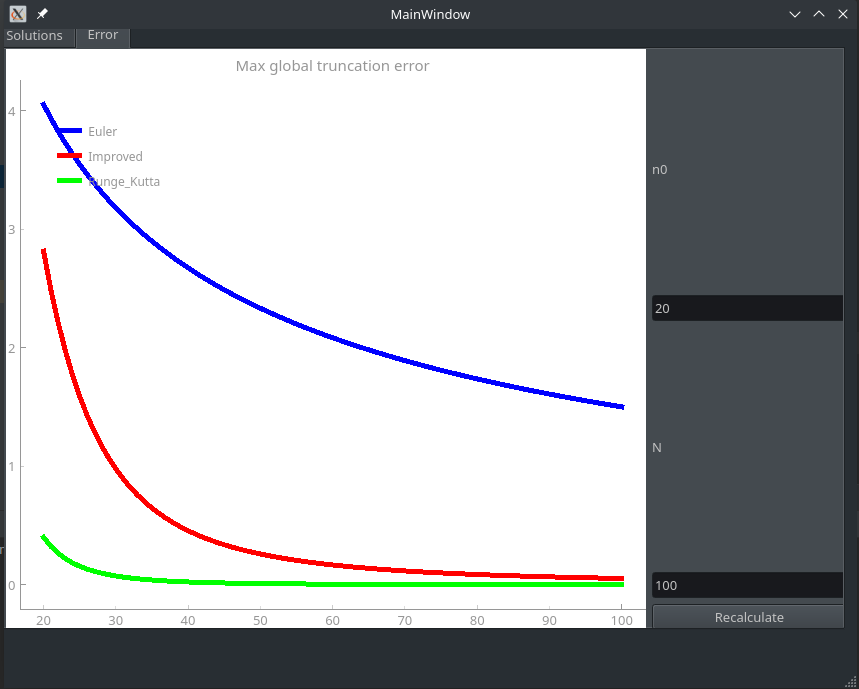

## DEApp

## Description

This repository contains the source code of DEApp - desktop application that helps to visualize numerical solutions of
differential equations.

This application can only solve hardcoded equation `np.exp(x) - 1 / (x + 1)`, given to me as a task, but you can
override default BaseDE class.

```python 
class BaseDE:

    @abstractmethod
    def calculate_y_deriv(self, x, y):
        pass

    @abstractmethod
    def calculate_y_exact(self, x):
        pass
```

## Visualization demo

In the first tab we could choose initial conditions for searching numerical solutions:

- `x0, y0` - initial conditions
- `X` - length of approximation interval
- number of steps = number of points approximate solution should be made of (more steps - more accurate the solution).
  Also, you can choose which method to visualize (Euler, Runge-Kutta, etc.) and you can ask for visualizing exact
  solution.


*Second tab of application, that visualizes solutions to DE and local truncation errors*


*First tab of application, that visualizes global truncation errors on each step from the interval*

## Stack of technologies

- Python
- PyQT5 - modern framework for making desktop layout of application
- numpy for mathematical computations

## How to launch the application

- make sure that you already have `python` and `pip` installed (you can run `python --version` for checking that)
- run `pip install -r requirements` for installing needed packages.
- run `python demo/run_application.py` for running application.

## Glossary

Local truncation error - maximum absolute difference between exact solution and predicted at each step approximate
solution. We take some exact point $$ (x_i, y_i) $$, compute predicted point at next step $$ (x_i + \delta h, \hat{y_i})
$$, and local error is absolute value of difference y_i and \hat{y_i}. In code, it is implemented like

```python 
lte = np.abs(local_predictions_at_each_step - y_exact)
```

Global truncation error - maximum absolute difference between exact and approximate solution. It is implemented in
python like

```python 
global_error = np.max(np.abs(y_exact - y_appr))
```

## Contributing to the project

Feel free to open PR and issues for this project!

## Author

Arslanov Shamil, student of Innopolis University


